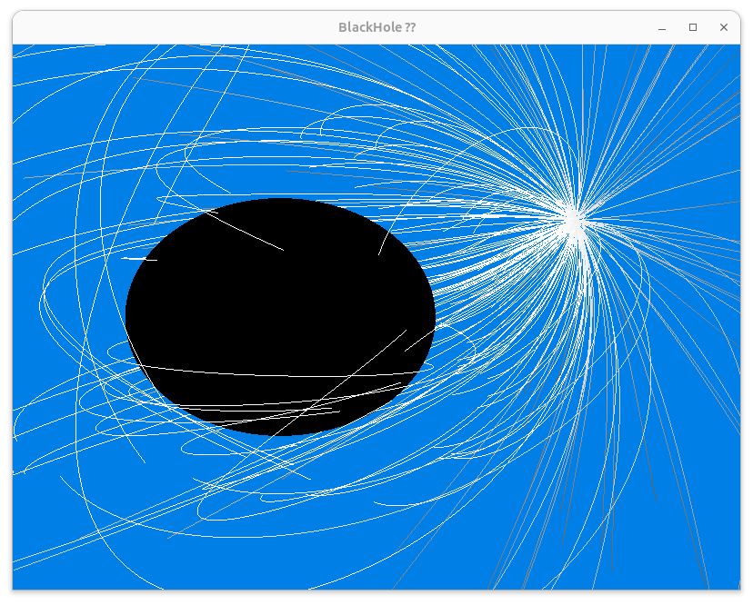

# YNOGK Kerr Simulations

Null Geodesic Simulation repository spawned from work on my master's thesis () and legacy code from ()

# Installation
The repository was developed and tested for Ubuntu 24.04 LTS only. Functionality on WSL or similar might be given but not guaranteed.

As of now, the repository provides a large library of useful Fortran/C functions in the `/src/ynogk.f90` file and visualizations in the `/include/Kerr_Sim/helpers/Renderer.h` and `Drawables.h`. The main executable of this repository is a simulation of a rotating black hole, with an isotropically emitting source closeby. The details of the simulation can be modified in `/src/main.cpp`.

## Requisites
As the repository is intended for Ubuntu >= 24.04 LTS, we will detail the installation instructions for this OS only here.
### 1. GCC and gFortran
You will need gcc and gfortran in order to compile the C++ and Fortran/C code libraries. To install them on your OS, open a terminal and enter
```bash
$ sudo apt-get update
$ sudo apt-get install gcc
$ sudo apt-get install gfortran
```

You can check if the installation was successful or if you have already installed the compilers by executing 
```bash
$ gcc -version
$ gfortran --version
```

### 2. CMake
The repository comes with a CMakeLists.txt, which is used to build the main executable and libraries. You need a CMake Version > 3.10. To install CMake, open a shell and execute the command
```bash
$ sudo apt-get install cmake pkg-config
$ cmake --version
```

### 3. OpenGL, glfw, GLEW, GLU, GLUT
For Visualizations, we use OpenGL and related libraries. In order for the visualizations to work, you need the OpenGL, GLEW, GLU, GLUT, glfw and math libraries installed. You can install all necessary libraries by executing
```bash
$ sudo apt-get update
$ sudo apt-get install cmake pkg-config
$ sudo apt-get install mesa-utils libglu1-mesa-dev freeglut3-dev mesa-common-dev
$ sudo apt-get install libglew-dev libglfw3-dev libglm-dev
$ sudo apt-get install freeglut3-dev
$ sudo apt-get install libao-dev libmpg123-dev
```

If you are unsure whether OpenGL was installed correctly, please follow [this](https://medium.com/geekculture/a-beginners-guide-to-setup-opengl-in-linux-debian-2bfe02ccd1e) page to compile a simple example program.

Note that the raytracing libraries in `/src/ynogk.f90` work independently of OpenGL. If you only wish to use these libraries and build your own executables, you can skip this installation step.

## Build

Clone/Download this repository. CD into the repository location and into the build directory (which should be empty as of the time of the download).
Open a shell inside the build directory and execute
```bash
$ mkdir build && cd build
$ cmake ..
$ cmake --build .
```
This should build the repository. Once completed, you can execute the program from within the build directory via
```bash
$ ./KERR_SIM
```
Which should yield something like this :

## Remarks
The main executable as a controllable camera using _WASD_-Controls and the mouse/touchpad. Qt/QML support will be added in the future as well as more examples/executables.
